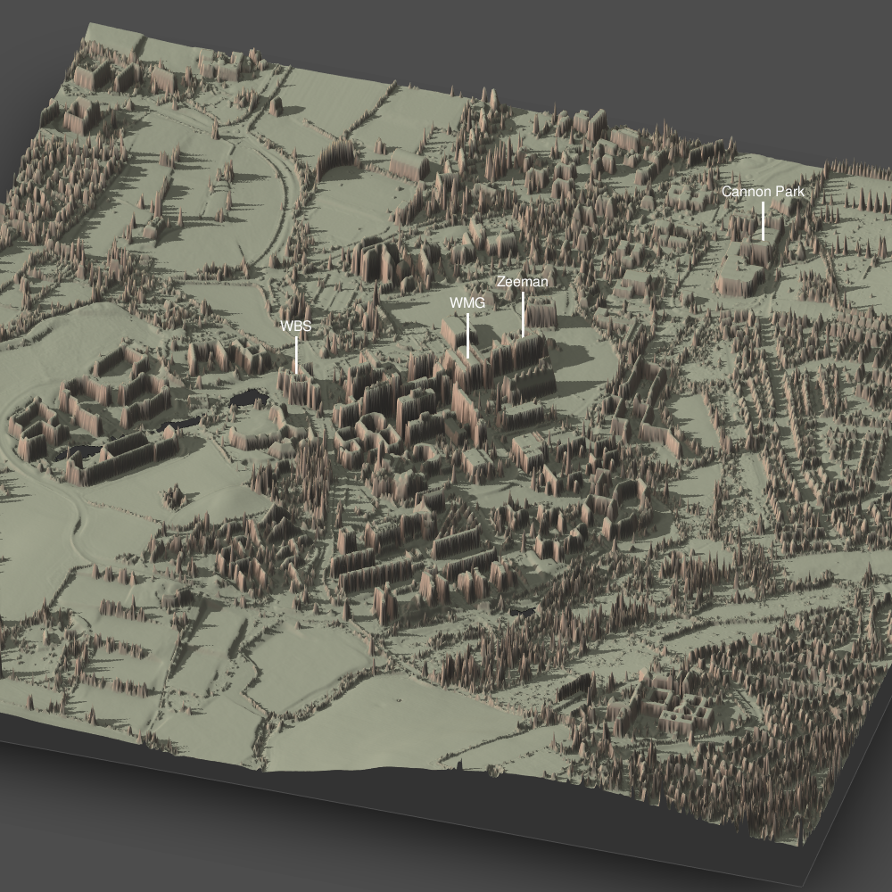

# 3D_models_UK
3D models of places in the UK created with [rayshader](https://www.rayshader.com)
R package.

# Resources

For installation instructions see [here](https://gist.github.com/tylermorganwall/bced3a66c65fb32763c525d0a8955ed4).
Follow this very extensive [tutorial](https://github.com/PennMUSA/MasterClass2019_3DMappingAndViz)
or browse the [rayshader website](https://www.rayshader.com) to learn more about
creating 3D plots in R.

For UK related lidar data, there is a very good, publicly available resource
[here](https://data.gov.uk/dataset/5f6f7d5b-3f4c-4476-bfb8-cda490c9cf0e/lidar-composite-dtm-50cm).
The data used for the examples in this repository comes from there. Which exact
tiles were used is described in the R scripts.

# Turning asc files into matrices usable by rayshader

The resource above will give you a bunch of asc files that need to be turned
into a matrix that can be plotted by rayshader. This is achieved using the code
below. Assuming you placed all the asc files into your working directory, run

```
raster_layers <- tibble(filename = list.files(path = getwd(),"*.asc$")) %>%
  mutate(raster =
           map(filename, .f = ~raster::raster(rgdal::readGDAL(.)))
  ) %>%
  pull(raster)
# Combine raster layers
raster_layers$fun <- mean
raster_mosaic <- do.call(raster::mosaic, raster_layers)
plottable_matrix <- raster_mosaic%>%
  raster_to_matrix()%>%
  reduce_matrix_size(0.5)
```

The last line `reduce_matrix_size` is not necessarily needed, but depending
on the size of your matrix you probably will want to run it to save some resources.

# Example

Warwick University Campus with labelled points of interest.


